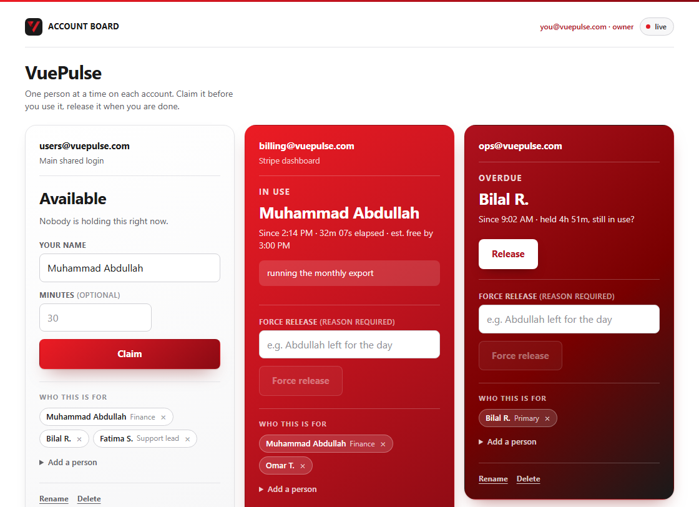
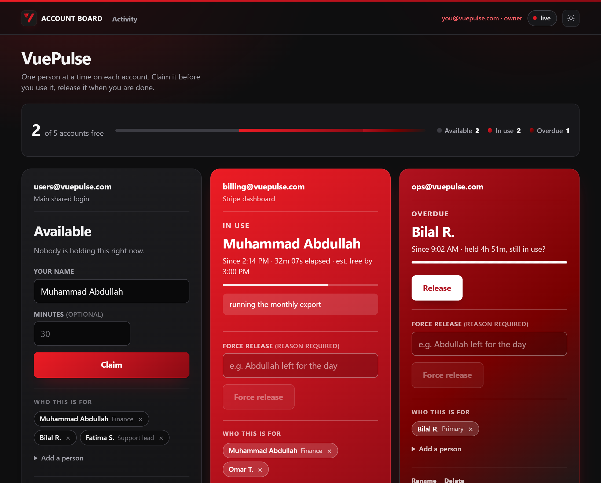

# VuePulse Account Board

**Which shared accounts are in use right now, and by whom?** One page, live for
everyone, no logins to remember.

<br clear="left">



<details>
<summary>The same board in the dark theme</summary>



</details>

## The problem

A team has a handful of logins only one person can use at a time — a billing
dashboard, a support seat, a shared inbox. Nothing technical stops two people
signing in at once; it just breaks, quietly, and someone loses work.

This board is the shared piece of paper on the wall. It says who has what, since
when, and when they expect to be done. That is the whole product.

## What it does

- **Claim and release.** Type your name, press Claim. Your name is remembered,
  so after the first time it is one click. Minutes are optional; empty means 30.
- **Live for everyone.** Every board updates within a second of any change, with
  no polling and no refresh. A ticking elapsed timer runs locally off a single
  server timestamp.
- **Overdue, visibly.** Past its estimate a card darkens toward black and the
  word changes to "Overdue". Nothing is auto-released — it just becomes obvious.
- **Force release, with a reason.** Admins can take an account back. The reason
  is required and both names go in the log. No confirm dialog, because dialogs
  train people to click through them.
- **A queue, once you've had it a while.** The holder gets 2.5 hours nobody can
  interrupt; after that, anyone can join the queue for that account, and the
  holder sees a plain "N people are waiting" line. Signal only — claiming stays
  first-come-first-served the moment it actually frees up.
- **One line for the whole board.** `2 of 5 accounts free`, with a meter, above
  the cards — the question people walk up with, answered before they read one.
- **Two admin-only pages, not one crowded one.** The activity summary (`Time
  held, by day` — who held what and for how long, totalled per person per
  account per day) is what "Activity" opens to; the append-only line-by-line
  log is one click further in. Both are narrowable by account and by date —
  today, the last 7 or 30 days, or any range you type — with their own
  filters, so neither page waits on the other to load.
- **The log pages itself in.** Only the most recent 200 entries load at
  first; a button fetches another 200 further back on demand, so the page
  stays fast no matter how long the log has grown.
- **The tab title stays put** — `VuePulse Account Board` — easy to find pinned.
- **Light and dark.** Follows the operating system by default; the toggle in the
  corner overrides it and is remembered.

## What it deliberately does not do

It is an **honour-system checkout board, not an access control system**, and
almost every design decision follows from that:

- **Nothing is enforced.** The app has no connection to the service being
  shared and cannot stop anyone doing anything. A lock that looks enforcing but
  is not would be worse than an honest sign.
- **No auto-release on disconnect, and no heartbeat.** People work at their
  desks and release when done. Auto-release would free an account out from under
  someone whose Wi-Fi blipped — exactly the failure the board exists to prevent.
- **No passwords and one role.** Reaching the page at all is handled at the edge
  by Cloudflare Access. The owner, who can add and rename accounts, is a
  hidden-buttons check, not a permission. See [Security, honestly](#security-honestly).
- **The queue is a signal, not a reservation.** Joining it does not stop anyone
  else — including someone not in it — from claiming the account the moment it
  frees up. It only tells the holder that people are waiting.

## How it works

Vanilla HTML, CSS and ES modules — no npm, no bundler, no framework, no build
step. The Firebase SDK is loaded from a CDN at a pinned version. The whole app
is a few hundred lines and deploys by copying the directory.

| Layer | Choice | Why |
|---|---|---|
| Frontend | Vanilla HTML + CSS + ES modules | No toolchain to maintain; deploys to any static host unchanged |
| Realtime state | Firebase Realtime Database | Push listeners, atomic transactions, a server clock, free at this scale |
| Auth | Firebase Anonymous Auth | Not to identify anyone — only so the rules can require `auth != null` |
| Hosting | Cloudflare Pages | Free, deploys from private repos, pairs with Access |
| Access control | Cloudflare Access | Keeps colleagues' names off the public internet, with no code |
| Owner identity | Access identity via a Pages Function | The reader's email is already authenticated at the edge |

### The three problems worth reading the code for

**Never trust the browser clock.** If one laptop is six minutes fast, its
`claimedAt` is wrong for everyone. `clock.js` reads Firebase's server offset at
startup and `serverNow()` applies it to every timestamp written and every
elapsed time shown. Nothing outside that file calls `Date.now()`. The network
carries one number and each browser does its own ticking, so the elapsed timer
survives a reload — it was never held in a counter.

**Claims must be atomic.** Two people pressing Claim in the same second must not
both win, and read-then-write eventually produces two holders. Every state
change in `lock.js` goes through `runTransaction`. Firebase may run a
transaction callback several times, so those callbacks are pure — no logging, no
DOM writes, no `await` — and log entries are appended after it resolves.

**The connection indicator reflects the connection, not message age.** A frozen
page showing "Available" is worse than no board at all. The obvious "last synced
N seconds ago" is wrong here: `onValue` only fires on change, so an account
sitting free for two hours is healthy and would look stale. It subscribes to
`.info/connected` instead, and cards visibly dim when the connection drops.

## Files

```
index.html          the board: markup, card templates, inline critical styles
activity.html       the activity summary — "Time held, by day", admin only
log.html            the full line-by-line log, admin only, one click from the summary
styles.css          all styling and the design tokens, shared by all three pages
app.js              the board: wiring, rendering, event handlers
activity.js         the activity summary: pairs log lines into held time, writes nothing
log.js              the full log: paged reads of /log, writes nothing
boot.js             Firebase init, sign-in, banner, connection pill, identity chip
lock.js             claim / release / force-release transactions
queue.js            join / leave the per-account queue
accounts.js         account metadata writes
identity.js         Cloudflare Access identity + the owner check
clock.js            server time offset and all time formatting
theme.js            the light/dark toggle, shared by both pages
grid.js             the lattice behind the page, on its own canvas
cardfx.js           what a card does under a pointer: sheen, glare, edge glow
functions/api/      one Pages Function, which answers "who is reading this?"
database.rules.json the rules to paste into the Firebase console
preview.html        every card state, rendered without Firebase
logo.png            the mark: favicon, wordmark, and source of the palette
```

Flat on purpose. No `src/`, no `components/`, no `utils/`, no state management
layer, no event bus. `boot.js` exists only because three pages need the same
few lines of startup — a shared prelude, not a framework.

`preview.html` fills the real `<template>` elements from `index.html` with
fixtures, so every card state can be looked at side by side without touching
live data. It is a design fixture, not a test runner; there is no test runner
and there should not be one.

Every colour in `styles.css` is sampled from `logo.png` rather than picked by
eye: `#EC1C24` falling to `#B0121F` with a `#780000` shadow, on `#1A1A1A`.

Those five hues are constants and belong to no theme. A theme may only change
surfaces and inks, which is why adding one means filling in a second list of
custom properties and touching nothing else. The red cards do not follow the
theme at all — they are lit panels rather than page background, and they are the
same colour under both.

The pointer is the one place the palette is not the material. It is dark
machined steel with the brand glowing out of the tip, because metal is grey and
borrows its colour from what is near it — a red arrow with a white gloss down
the middle is how a sticker is drawn, not how metal looks. A second, brighter
copy appears over anything clickable, and text fields keep an ordinary I-beam.
Both are `cursor:` values in `styles.css` and no JavaScript is involved: a div
chasing the mouse is always a frame behind, and hiding that would mean hiding
the real pointer.

The cards' sheen, glare and edge glow are ported from Aceternity's `glare-card`
and `glowing-effect`, which are React with Tailwind and framer-motion. The
behaviour crossed over; the code did not, and three things were changed rather
than translated:

- **No rainbow.** `glare-card`'s foil cycles six hues through three blend modes.
  On a board with one hue that would be the loudest thing on the page. The foil
  here is brushed steel and the logo's black — the same material as the pointer.
- **The light goes under the text, not over it.** The original glazes the whole
  card. A specular crossing a form label breaks the rule two paragraphs up, so
  these layers light the surface and leave the type alone.
- **The tilt is small, and it stops.** Ten degrees is right for a showcase card
  sitting alone; on a card holding a form it moves the Claim button away from
  the pointer reaching for it. Three degrees, and flat the moment focus lands
  inside.

`cardfx.js` writes to the hovered card and nothing else, so a board of twelve
repaints one. Under `prefers-reduced-motion` it writes nothing at all.

## Data model

```
/accounts/{id}   label, description, createdAt, users/{id}: { name, note }
/locks/{id}      status "free" | "held", holder, email, claimedAt, expectedMinutes
/queue/{id}/{entryId}   name, email, joinedAt
/log/{pushId}    accountId, accountLabel, name, email, action, at, reason, heldBy
```

Three decisions in there are load-bearing:

- **Locks live outside `/accounts`.** Account metadata is owner-written and
  changes almost never; locks are written by everyone, constantly, through
  transactions. Nesting them would put a transaction path inside a node the
  owner also rewrites.
- **`accountLabel` and `heldBy` are denormalised into the log** so a line still
  reads after the account or the hold it refers to is gone. Deleting an account
  removes its card and its lock and leaves its history intact.
- **The log is append-only**, enforced by `!data.exists()` in the rules: entries
  can be created but never edited or deleted from a client. That is the entire
  point of having one.

`holder` is typed by a human and `email` comes from Access, so where they
disagree the email is the one to believe — and the log shows both.

## Run it locally

ES modules will not load over `file://`, so serve the directory:

```
python -m http.server 8000
```

Then open <http://localhost:8000>. `localhost` is a Firebase authorized domain
by default, so anonymous sign-in works with no extra setup. If the config is
missing or sign-in fails, the page explains what to fix instead of failing
silently.

There is no Access edge on localhost, so nobody is recognised as the owner.
`?admin=1` turns the owner controls on for the session (`?admin=0` turns them
off); it is scoped to loopback and cannot be triggered on the deployed site.

Standing up your own instance — Firebase project, rules, Cloudflare Pages,
Access — is in **[RUNBOOK.md](RUNBOOK.md)**.

## Security, honestly

Worth being precise about, because parts of this look like security and are not.

**What is real:** Cloudflare Access authenticates a real email at the edge
before the page loads, for every path on the hostname. Nobody outside the policy
sees anything.

**What is not:** everything after that point. Firebase auth here is anonymous,
so the database rules cannot tell one reader from another — they can only say
"someone signed in". Which means:

- The **owner check hides buttons.** A teammate with devtools can still write to
  `/accounts`. It is a tidy-up, not a permission.
- The **activity summary and full log pages** show the log — and their
  filters — to the owner and an explanation to everyone else, and the nav
  link to them only renders for the owner. A non-owner's browser never
  fetches the log — but the entries are still in Firebase and still readable
  by anyone already past Access. A curtain, not a lock. The filters narrow
  what is on screen; they are not a privacy boundary either.
- **`firebase-config.js` is committed** because the static host must serve it.
  The web API key is not a secret and is designed to ship in client code, but
  the rules only require anonymous sign-in — so anyone holding that config can
  read and write this board. Access and the repo being private are what close
  that gap.

**If you fork this,** use your own Firebase project, keep the repo private or
strip the config, and put something in front of it. If any of the above ever has
to be genuinely enforced, the answer is Firebase Google sign-in so the rules can
check `auth.token.email` — accepting a second auth path through the app. That
trade was made deliberately; see `plan.md` §2.2.

## Deliberately not built

Listed so the decisions stay visible, not as a roadmap.

- **A Slack or Discord webhook on release** — turns "check the board" into "the
  board tells me". About 15 lines, and the strongest candidate for the next
  addition.
- **An enforced owner.** See [Security, honestly](#security-honestly).

## Docs

- **[RUNBOOK.md](RUNBOOK.md)** — Firebase and Cloudflare setup, deploy, adding
  people, the testing checklist, and the gotchas that cost the most time.
- `plan.md` — what the current round of work intends.
- `context.md` — what is currently true.
- `account-board-implementation-plan.md` — the v1 spec, kept as history.
